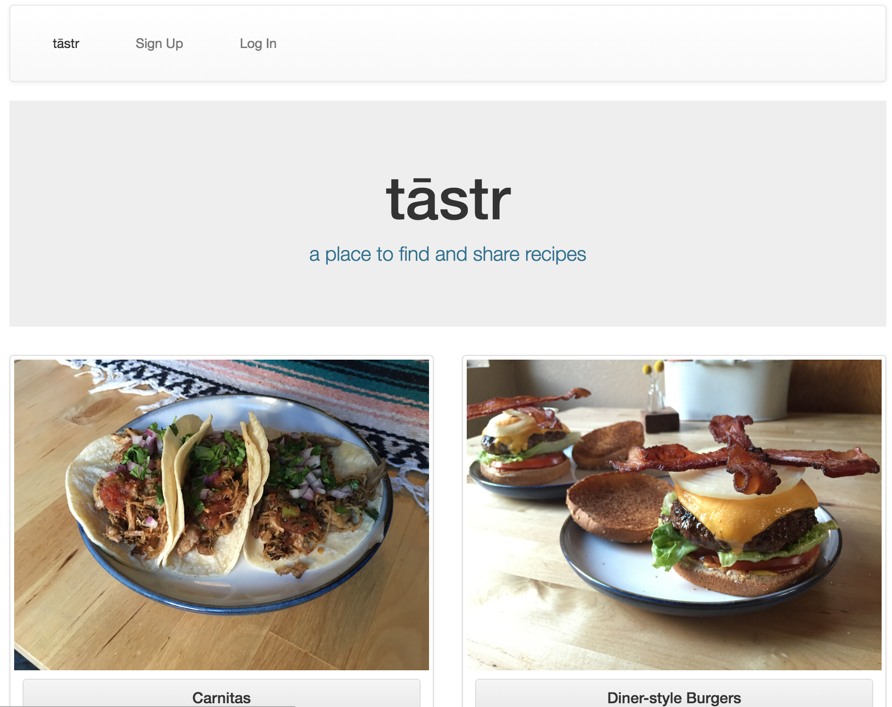

#[tāstr](https://floating-brushlands-79659.herokuapp.com/)

####A place to find and share recipes

######by Jacob Allen

___

###Description

___

This app will allow users to browse and upload recipes with other users.
It will do so in a way that is user-friendly and intuitive, yet highly impactful.

###User Instructions
___

[tāstr](https://floating-brushlands-79659.herokuapp.com/) is an app for finding and sharing recipes. 

To use tāstr, simply click the "sign up" button and fill in the necessary information.  Once signed up, a user can return to the sight at a later time and use the "log in" button. 

Users can browse recipes posted by others and "like" them.  When logged in, users can also post their own recipes. 

Users can upload pictures to their profile and to recipes for showing off their finished recipes.  

###Technologies used
___
This is a full-stack Ruby on Rails application that utilizes HTML, CSS, Bootstrap, JavaScript, jQuery, PostgresQL, and is deployed on Heroku. 

###Design
___
My goal was to make a simple application that could benefit people. My inspiration began with my own personal interest in cooking.  

After the backend infrastructure was in place, I looked to Bootstrap for design inspiration.  Bootstrap takes away a lot of the stress of styling, while also adding a modern familiarity to the site.  

My original wireframe designs were not difficult to attain with the help of Bootstrap.  Some minute differences are present, but I'm happy with the overal look and feel of my app.  

Here's a link to my [Trello](https://trello.com/b/gKjgF9uc/tastr) page.

###Unsolved problems
___
1.  The app has an issue that occurrs when a new user that has not yet posted a recipe tries to visit their own profile.  The code breaks down where it expects to find a recipe owner.  I have placed a band-aid solution for the problem by only making the profile link active if the user has posted a recipe.  While this does remove the issue from view, a user could visit the problematic page by entering the profile path in the url.
2. I wanted to have a comment feature that allows interaction between users.  I did not have enough time to implement this feature.
3. I also wanted a feature for tags that would primarily be used for keywords and ingredient names.  This would allow users to post individual ingredients for their recipes.
4. I would have liked to add a search feature that would allow users to search for other users as well as search recipes by tags.

###Acknowledgments
___
-Instructors

-Stephen Kempitsy

-Adrian Delpha

-Kyle Firstenburg